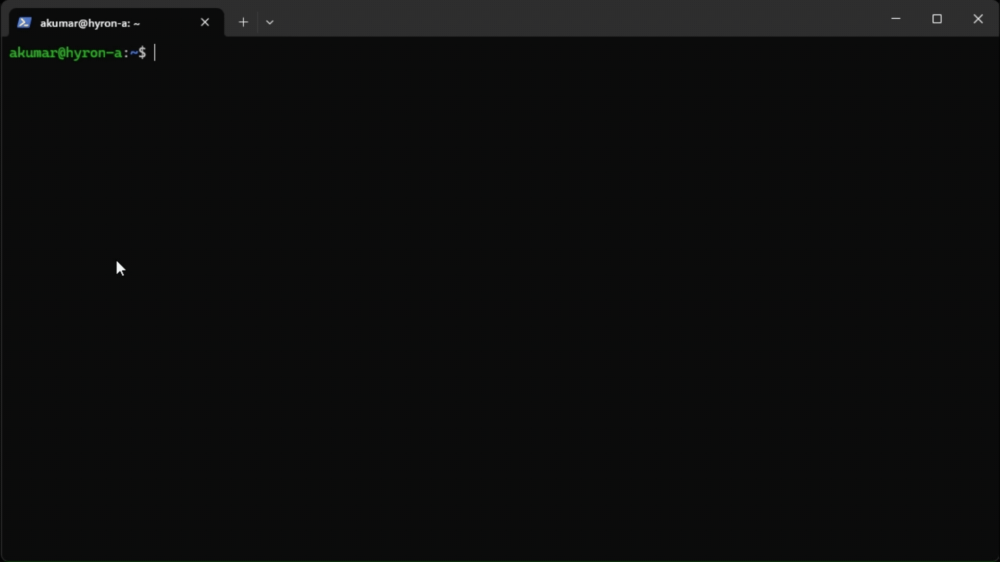

# Digital Product Passport

[](LICENSE)

[](https://github.com/nmis-group/remake_dpp/issues)
[](https://github.com/nmis-group/remake_dpp/pulls)


## Contents

- [Description](#description)
- [Package Layout](#package-layout)
- [Requirements](#requirements)
- [Installation](#installation)
- [Usage Example](#usage-example)

---
## Description

A modular Python package that enables manufacturing companies to create interoperable Digital Product Passports (DPPs) by mapping their existing business data to standardized DPP data models using automated semantic matching and intuitive configuration tools.

---
## Package Layout

```text
remake_dpp/
├── docs/
│   ├── api-model.md
│   ├── api-schema-registry.md
│   ├── concepts-gas.md
│   ├── docs.json
│   ├── intro.md
│   ├── quickstart.md
│   ├── schemas-eclass.md
│   ├── schemas-isa95.md
│   └── usage-python.md
├── nmis_dpp/
│   ├── mappers/
│   │   ├── __init__.py
│   │   ├── eclass_mapper.py
│   │   └── isa95_mapper.py
│   ├── ontology_data/
│   │   ├── eclass_16/
│   │   │   ├── dictionary_assets_en/
│   │   │   │   ├── ECLASS16_0_ASSET_EN_SG_13.xml
│   │   │   │   ├── ...     
│   │   │   │   └── ECLASS16_0_ASSET_EN_SG_90.xml
│   │   │   ├── unitsml_en/
│   │   │   │   └── ECLASS16_0_UNITSML_EN.xml 
│   │   │   └── ECLASS_ASSET_XML_Read_Me_EN_v1.pdf 
│   │   ├── isa95/
│   │   │   ├── Documentation/  
│   │   │   │   ├── B2MML-BatchML-CodeGeneration.docx
│   │   │   │   ├── B2MML-Documentation.pdf
│   │   │   │   ├── B2MML-JSON-Documentation.pdf
│   │   │   │   ├── BatchML-BatchInformation.docx                                                
│   │   │   │   ├── BatchML-BatchProductionRecord.docx
│   │   │   │   └── BatchML-GeneralRecipe.docx
│   │   │   ├── Examples/  
│   │   │   │   ├── BatchML v02 Cough Syrup Example Files.zip
│   │   │   │   ├── BatchML v0401 Example with extensions.zip
│   │   │   │   ├── Courbon B2MML v0401 Example XML Files.zip
│   │   │   │   ├── Readme.txt
│   │   │   │   └── ReportAboutUseOfB2MMLinARTISAN.pdf
│   │   │   ├── Schema/  
│   │   │   │   ├── AllSchemas.json
│   │   │   │   ├── B2MML-AllExtensions.xsd
│   │   │   │   ├── B2MML-Common.xsd                                               
│   │   │   │   ├── B2MML-CommonExtensions.xsd
│   │   │   │   ├── ...
│   │   │   │   └── BatchML-GeneralRecipeExtensions.xsd
│   │   │   └── README.md
│   │   └── README.md 
│   ├── __init__.py                     # Package initialization 
│   ├── cli.py                          # Command line interface 
│   ├── eclass_build_mapping.py         # ECLASS build mapping 
│   ├── isa95_build_mapping.py          # ISA95 build mapping 
│   ├── model.py                        # Core models for DPP layers 
│   ├── part_class.py                   # Universal part class set 
│   ├── schema_base.py                  # Base schema for DPP layers 
│   ├── schema_registry.py              # Schema registry 
│   └── utils.py                        # Any helper functions 
├── tests/ 
│   ├── test_mappers.py                 # Test mappers 
│   ├── test_model.py                   # Test models 
│   ├── test_part_class.py              # Test part classes 
│   ├── test_registry_extended.py       # Test registry extended 
│   ├── test_schema_registry.py         # Test schema registry 
│   └── test_schema_registry_second.py  # Test schema registry second 
├── .gitignore                          # Git ignore 
├── .gitattributes                      # Git attributes
├── coffee_machine.json                 # Coffee machine DPP 
├── eclass_part_class_mapping.yaml      # ECLASS part class mapping
├── generate_dpp_json.py                # Generate Coffee Machine DPP JSON 
├── isa95_part_class_mapping.yaml       # ISA95 part class mapping 
├── LICENSE.txt                         # License 
├── package.json                        # Package configuration 
├── PRD_DPP.md                          # Product requirements document 
├── pyproject.toml                      # Project configuration 
├── README.md                           # README 
└── usage.py                            # Usage example
```
---

## Requirements
- Python 3.7+
- No external dependencies (uses Python dataclasses and standard library)

---

## Installation
### From PyPI

```shell
pip install remake_dpp
```


### From Source

```shell
git clone git@github.com:nmis-group/remake_dpp.git
cd remake_dpp  
pip install .
```  


---

## Usage Example

We have created a simple python file to showcase the usage.
```shell
cd remake_dpp

# 1. Generate a sample DPP JSON file (using helper script or usage_test logic)
python generate_dpp_json.py

# 2. Run the main usage script with input file and target schema
python usage.py coffee_machine.json ECLASS
# python usage.py coffee_machine.json ISA-95
```

---

## Quick Start Steps
1. Install with `pip` or from source.
2. Import model layers and part classes.
3. Create instances and assemble your passport.

---

## License
Distributed under the MIT License. See `LICENSE.txt` for details.

---


