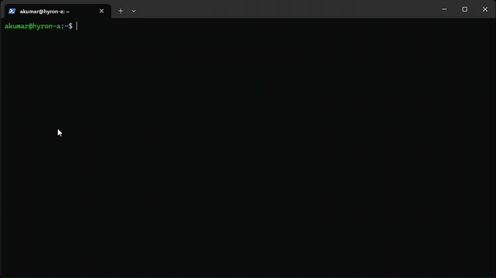

# Digital Product Passport

[](LICENSE)

[](https://github.com/nmis-group/remake_dpp/issues)
[](https://github.com/nmis-group/remake_dpp/pulls)


## Contents

- [Description](#description)
- [Installation](#installation)
- [Package Layout](#package-layout)
- [Requirements](#requirements)
- [Documentation](#documentation)
- [Contributing](#contributing)
- [License](#license)

---

## Description

A modular Python package that enables manufacturing companies to create interoperable Digital Product Passports (DPPs) by mapping their existing business data to standardized DPP data models using automated semantic matching and intuitive configuration tools.

---

## Installation
### From PyPI

```shell
pip install remake_dpp
```


### From Source

```shell
git clone git@github.com:nmis-group/remake_dpp.git
cd remake_dpp  
pip install .
```  


---

## Package Layout

```text
remake_dpp/
├── docs/
│   ├── assets/
│   │   ├── architecture-diagram.svg    # System architecture & component relationship diagram
│   │   ├── logo-dark.png
│   │   └── logo-light.png
│   ├── api-model.md
│   ├── api-schema-registry.md
│   ├── concepts-gas.md
│   ├── docs.json
│   ├── intro.md
│   ├── quickstart.md
│   ├── schemas-eclass.md
│   ├── schemas-isa95.md
│   └── usage-python.md
├── nmis_dpp/
│   ├── mappers/
│   │   ├── __init__.py
│   │   ├── battery_dpp_mapper.py       # EU Battery Passport mapper (Reg 2023/1542)
│   │   ├── eclass_mapper.py
│   │   ├── isa95_mapper.py
│   │   └── textile_dpp_mapper.py       # open-dpp EU Textile DPP mapper (ESPR, schema v0.5.0)
│   ├── ontology_data/
│   │   ├── eclass_16/
│   │   │   ├── dictionary_assets_en/
│   │   │   │   ├── ECLASS16_0_ASSET_EN_SG_13.xml
│   │   │   │   ├── ...     
│   │   │   │   └── ECLASS16_0_ASSET_EN_SG_90.xml
│   │   │   ├── unitsml_en/
│   │   │   │   └── ECLASS16_0_UNITSML_EN.xml 
│   │   │   └── ECLASS_ASSET_XML_Read_Me_EN_v1.pdf 
│   │   ├── isa95/
│   │   │   ├── Documentation/  
│   │   │   │   ├── B2MML-BatchML-CodeGeneration.docx
│   │   │   │   ├── B2MML-Documentation.pdf
│   │   │   │   ├── B2MML-JSON-Documentation.pdf
│   │   │   │   ├── BatchML-BatchInformation.docx                                                
│   │   │   │   ├── BatchML-BatchProductionRecord.docx
│   │   │   │   └── BatchML-GeneralRecipe.docx
│   │   │   ├── Examples/  
│   │   │   │   ├── BatchML v02 Cough Syrup Example Files.zip
│   │   │   │   ├── BatchML v0401 Example with extensions.zip
│   │   │   │   ├── Courbon B2MML v0401 Example XML Files.zip
│   │   │   │   ├── Readme.txt
│   │   │   │   └── ReportAboutUseOfB2MMLinARTISAN.pdf
│   │   │   ├── Schema/  
│   │   │   │   ├── AllSchemas.json
│   │   │   │   ├── B2MML-AllExtensions.xsd
│   │   │   │   ├── B2MML-Common.xsd                                               
│   │   │   │   ├── B2MML-CommonExtensions.xsd
│   │   │   │   ├── ...
│   │   │   │   └── BatchML-GeneralRecipeExtensions.xsd
│   │   │   └── README.md
│   │   └── README.md 
│   ├── __init__.py                     # Package initialization
│   ├── adapters.py                     # Input adapters (ECLASS XML, ISA-95, CSV → DPP)
│   ├── api.py                          # High-level facade for the package
│   ├── cli.py                          # Command line interface 
│   ├── eclass_build_mapping.py         # ECLASS build mapping 
│   ├── isa95_build_mapping.py          # ISA95 build mapping 
│   ├── model.py                        # Core models for DPP layers 
│   ├── part_class.py                   # Universal part class set 
│   ├── schema_base.py                  # Base schema for DPP layers 
│   ├── schema_registry.py              # Schema registry 
│   └── utils.py                        # Any helper functions 
├── tests/
│   ├── BatteryPassDataModel-main/      # BatteryPass Consortium v1.2.0 reference schemas
│   │   ├── BatteryPass/                # SAMM aspect models (TTL) and generated artefacts
│   │   │   ├── io.BatteryPass.CarbonFootprint/
│   │   │   ├── io.BatteryPass.Circularity/
│   │   │   ├── io.BatteryPass.GeneralProductInformation/
│   │   │   ├── io.BatteryPass.MaterialComposition/
│   │   │   ├── io.BatteryPass.Performance/
│   │   │   └── io.BatteryPass.SupplyChainDueDiligence/
│   │   └── docs/                       # BatteryPass consortium deliverables (PDFs)
│   ├── open-dpp-main/                  # open-dpp EU Textile DPP field schema (v0.5.0)
│   │   ├── schemas/textile/
│   │   │   ├── schema.json             # 18-field textile schema (M1/M2/M3 mandate tiers)
│   │   │   └── responsibility_matrix.json
│   │   └── data/milestones.json        # DPP legislative tracker
│   ├── JSON_Payload/
│   │   └── BattreyPassportPayload.json # Real-world Catena-X battery passport payload
│   ├── test_api.py                     # Tests for the high-level API facade
│   ├── test_battery_dpp_mapper.py      # BatteryDPPMapper unit tests + BatteryPass v1.2.0 compliance scoring
│   ├── test_mappers.py                 # Tests for ECLASS and ISA-95 mappers
│   ├── test_model.py                   # Tests for DPP layer models
│   ├── test_part_class.py              # Tests for part class hierarchy
│   ├── test_payload_battery_pass.py    # End-to-end: Catena-X payload → DPP → BatteryPass compliance
│   ├── test_registry_extended.py       # Extended schema registry tests
│   ├── test_schema_f1_coverage.py      # Precision / recall / F1 coverage metrics vs literature baselines (Battery)
│   ├── test_schema_registry.py         # Schema registry tests
│   ├── test_schema_registry_second.py  # Additional registry tests
│   └── test_textile_schema_f1_coverage.py  # Precision / recall / F1 coverage metrics vs literature baselines (Textile)
├── .gitignore                          # Git ignore 
├── .gitattributes                      # Git attributes
├── coffee_machine.json                 # Coffee machine DPP example
├── eclass_part_class_mapping.yaml      # ECLASS part class mapping
├── generate_dpp_json.py                # Generate Coffee Machine DPP JSON 
├── isa95_part_class_mapping.yaml       # ISA95 part class mapping 
├── LICENSE.txt                         # License 
├── package.json                        # Package configuration 
├── PRD_DPP.md                          # Product requirements document 
├── pyproject.toml                      # Project configuration 
├── README.md                           # README 
└── usage.py                            # Usage example
```
---

## Requirements
- Python 3.7+
- No external dependencies (uses Python dataclasses and standard library)
- `pyproject.toml` - for package configuration

---

## Documentation

The documentation can be loaded by navigating to the [docs/](docs/) directory after cloning the repository and running the command:

```shell
mint dev
```

This will start a local web server and open the documentation in your browser.

---

## Contributing

Refer to [CONTRIBUTING.md](CONTRIBUTING.md) for more information.

---

## License
Distributed under the MIT License. See `LICENSE.txt` for details.

---


